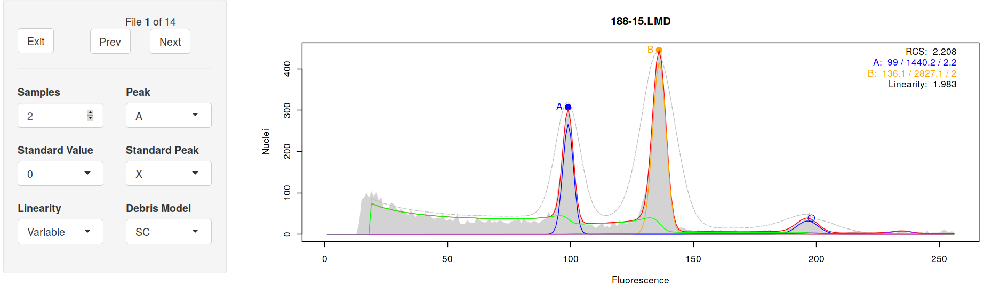

# Introduction
A tutorial overview of `flowPloidy` is available on
the
[Bioconductor website](http://bioconductor.org/packages/release/bioc/vignettes/flowPloidy/inst/doc/flowPloidy-gettingStarted.html).
This vignette is provided with the package, so once you have `flowPloidy`
installed you can access it from with R (see below).

# Installation

## Stable Version

`flowPloidy` is available in [Bioconductor](https://bioconductor.org).

To install it, you need to install the `bioconductor` R package (more
details on the [Bioconductor site ](http://bioconductor.org/install/)):

```{r}
## try http:// if https:// URLs are not supported
source("https://bioconductor.org/biocLite.R")
biocLite()
```

Once that's installed, you can install `flowPloidy` using the Bioconductor
tools:

```{r}
biocLite("flowPloidy")
biocLite("flowPloidyData")   # (optional) data for the examples
```

This should pull in all the package dependencies for `flowPloidy`, after
which you can load the package with the normal function
`library("flowPloidy")`.

## Development Version

As of May 2018, I have a new analysis method in the works. This is aimed at
assessing endopolyploidy, where a single sample may have four or more
peaks. The intent is to compare the number of cells in each peak, rather
than to determine a ratio relative to a co-chopped standard.

This new code will be incorporated into Bioconductor for the next release.
If you'd like to try it now, you can install it directly from the GitHub
repository as follows: 

```{r}
## Install Bioconductor tools first:
source("https://bioconductor.org/biocLite.R")
biocLite()

## Install flowCore from Bioconductor:
biocLite("flowCore")

## Install devtools so you can directly access GitHub
install.packages(devtools)
library(devtools)

## Install flowPloidy:
install_github("plantarum/flowPloidy", dependencies = TRUE, 
    build_vignettes = TRUE, ref = "endopolyploidy")
```

If the last command fails, particularly with complaints about building a
vignette, or reference to Pandoc, try with `build_vignettes = FALSE`
instead.

Note that I haven't yet updated the documentation to match the new code. To
use the endopolyploidy workflow, you need to use a new argument, `G2 =
FALSE` in your call to `FlowHist` or `batchFlowHist`. This excludes the G2
peaks from peak fitting, treating each peak as an independent group of
cells. You may also want to increase the `samples` argument to match the
number of peaks; however, you can correct this in `browseFlowHist`, so
that's not critical.


```{r }
## loading files for endopolyploidy analysis:
batch1 <- batchFlowHist(endo_files, channel="FL3.INT.LIN", G2 = FALSE,
    samples = 5)

batch1 <- browseFlowHist(batch1)
```

Expanding `flowPloidy` to handle up to six peaks (and now potentially an
unlimited number if needed) required reworking a bunch of the existing
code, and as part of this the column headings in the tables produced by
`tabulateFlowHist` are now different from the previous release.

# Getting Started

```{r}
library("flowPloidy")
```

The `flowPloidy` workflow is documented in the vignette, which you can view
from R:

```{r}
fpVig <- vignette("flowPloidy-overview")
fpVig ## open vignette in a browser
edit(name = fpVig) ## open vignette source code in a text editor
```

It is also available [online](http://bioconductor.org/packages/release/bioc/vignettes/flowPloidy/inst/doc/flowPloidy-gettingStarted.html).

# Getting Help
For general help using the package, you can post questions on
the [Bioconductor Support Site](https://support.bioconductor.org/). Use the
tag `flowploidy` to ensure your question is brought to my attention.

The development repository for `flowPloidy` is
on [Github](https://github.com/plantarum/flowPloidy), and you can file bugs
there using the **issues** tab. You are also welcome to contribute features
or bug-fixes via pull requests!
