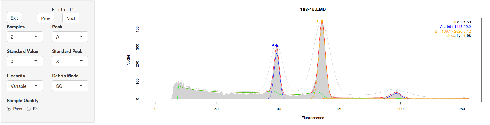
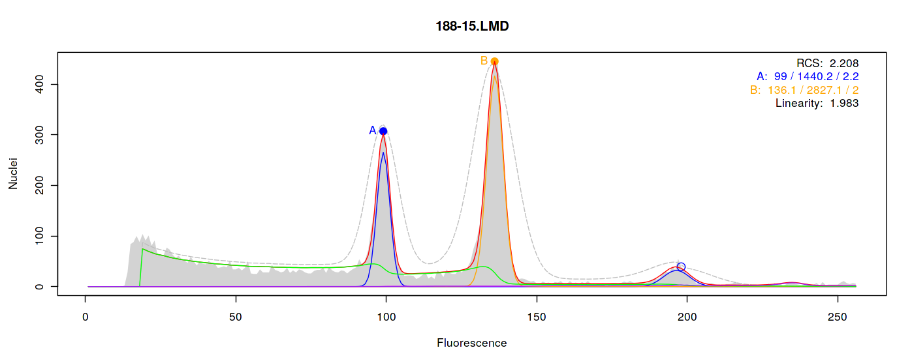
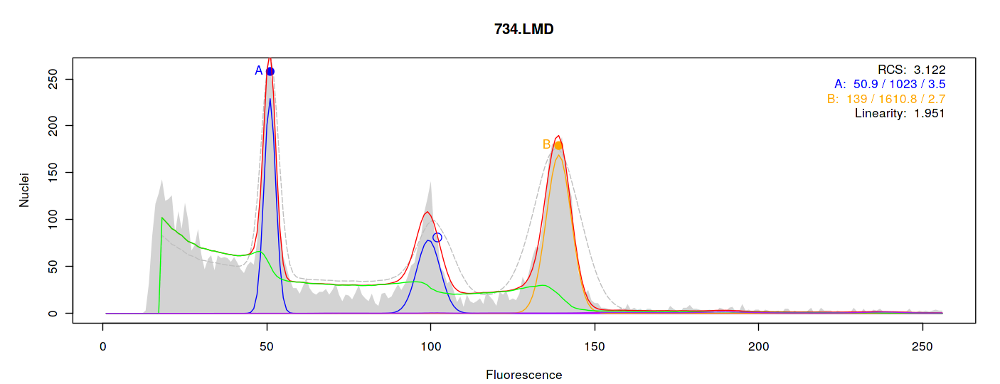
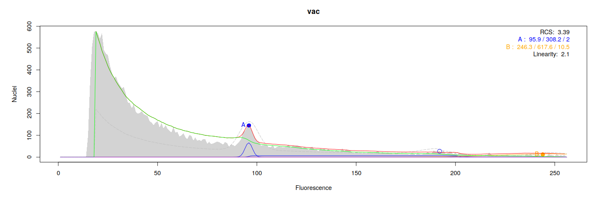
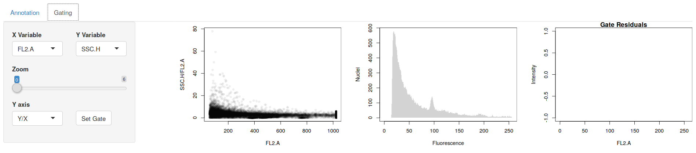
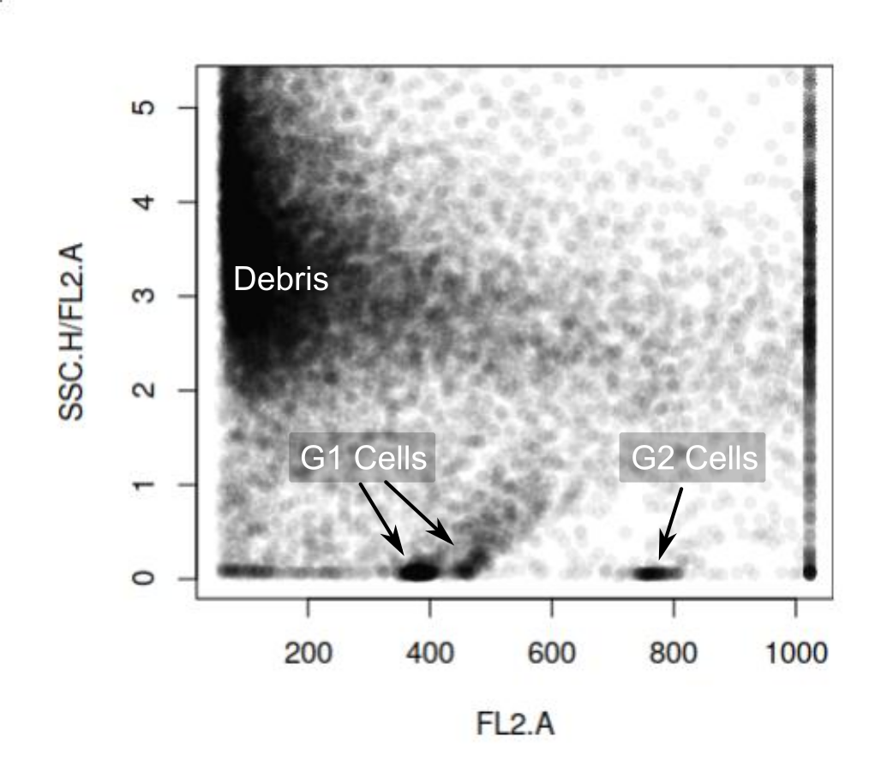
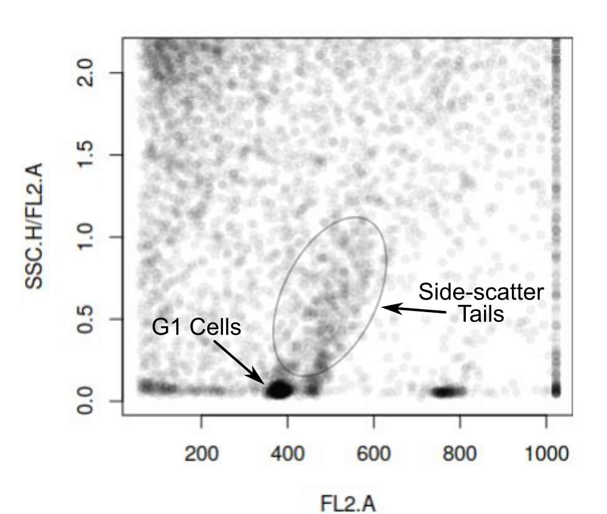

```{r setup, echo = FALSE}
library(knitr)
library(flowPloidy)
library(flowPloidyData)
```

# Motivation

Evolutionary biologists working with polyploid taxa

Population screening:

- large sample sizes
- poor tissue quality

Genome size assessment:

- repeat measurements of fresh/greenhouse tissue
- high precision required

Need **high-throughput**, **high-precision** genome size estimates

# Histogram Analysis
## Tissue preparation

Chop and stain tissue

- solution contains 1000s of individual nuclei (and debris)

## Flow Cytometer

Measure the fluorescence properties of each nuclei:
    
- size (forward scatter)
- DNA content (fluorescence)
- granularity (side scatter)

## Histogram Construction

- aggregate data into bins (256, 512, 1024)

# Ideal Histogram

\center

```{r ideal histogram, echo = FALSE}
plot(x = 1, type = 'n', xlim = c(0, 256), ylim = c(0, 500),
     ylab = "Nuclei", xlab = "Fluorescence", main = "")
abline(h = 0)
lines(x = c(80, 80), y = c(0, 325), lwd = 3)
lines(x = c(160, 160), y = c(0, 150), lwd = 3)
tmpfun <- function(x) 100 * exp(-x/80)
curve(tmpfun, 80, 160, add = TRUE, lwd = 3)
text(x = 80, y = 325, "G1 Peak", pos = 3, cex = 2)
text(x = 160, y = 150, "G2 Peak", pos = 3, cex = 2)
text(x = 120, y = 30, "S Phase", pos = 3, cex = 2)
```

# Histogram Components

**G1 peak** Gap 1 diploid cells

**G2 peak** Gap 2 tetraploid cells (pre-division)

**S Phase** Synthesis cells (actively duplicating DNA)

\transparent{0}

**Debris** Damaged nuclei, cell components, contaminants

**Aggregates** clusters of two or more nuclei stuck together

**NOISE** Measurement error, capriciousness of life

\transparent{0.4}
(**Co-Chopped Standard Peak** ignored for now)

# Empirical Histogram

```{r real histogram, echo = FALSE}
set.seed(1234)
plot(x = 1, type = 'n', xlim = c(0, 256), ylim = c(0, 500),
     ylab = "Nuclei", xlab = "Fluorescence")
abline(h = 0)

vals <- rep(0, 256)
vals <- jitter(3500 * dnorm(0:256, mean = 80, sd = 80 * 0.05), amount = 20)
vals <- vals + jitter(200 * exp ((0:-256)/60), amount = 5)
vals <- vals +
  jitter(2500 * dnorm(0:256, mean = 160, sd = 160 * 0.05), amount = 20)
vals[80:160] <- vals[80:160] + jitter(100 * exp((-80:-160)/80),
                                      amount = 5)
vals[vals < 0] <- 0
points(vals, type = 'l')

text(x = 80, y = 450, "G1 Peak", pos = 3, cex = 2)
text(x = 160, y = 200, "G2 Peak", pos = 3, cex = 2)
text(x = 120, y = 100, "S Phase", pos = 3, cex = 2)
text(x = 40, y = 170, "Debris", pos = 3, cex = 2)
text(x = 240, y = 40, "Aggregates", pos = 3, cex = 2)
```

# Histogram Components

\transparent{0.4}

**G1 peak** Gap 1 diploid cells

**G2 peak** Gap 2 tetraploid cells (pre-division)

**S Phase** Synthesis cells (actively duplicating DNA)

\transparent{1}

**Debris** Damaged nuclei, cell components, contaminants

**Aggregates** clusters of two or more nuclei stuck together

**NOISE** Measurement error, capriciousness of life

\transparent{0.4}

(**Co-Chopped Standard Peak** ignored for now)

# Manual Histogram Analysis

```{r manual analysis, echo = FALSE}
set.seed(1234)
plot(x = 1, type = 'n', xlim = c(0, 256), ylim = c(0, 500),
     ylab = "Nuclei", xlab = "Fluorescence",
     main = "")
abline(h = 0)

vals <- rep(0, 256)
vals <- jitter(3500 * dnorm(0:256, mean = 80, sd = 80 * 0.05), amount = 20)
vals <- vals + jitter(200 * exp ((0:-256)/60), amount = 5)
vals <- vals +
  jitter(2500 * dnorm(0:256, mean = 160, sd = 160 * 0.05), amount = 20)
vals[80:160] <- vals[80:160] + jitter(100 * exp((-80:-160)/80),
                                      amount = 5)
vals[vals < 0] <- 0
points(vals, type = 'l')
rect(70, 0, 95, 475, border = 2, lwd = 3)
```

# Manual Histogram Analysis

## Advantages

- Intuitive
- Several Programs Available
- Can be done ad-hoc in R

## Disadvantages

- Subjective
    - CV estimate depends on user
- Doesn't account for overlapping components
    - G1 cell count estimate inflated by debris and S-phase

# Overlapping Histogram Components

```{r individual components, echo = FALSE}
set.seed(1234)
plot(x = 1, type = 'n', xlim = c(0, 256), ylim = c(0, 500),
     ylab = "Nuclei", xlab = "Fluorescence",
     main = "")
abline(h = 0)

vals <- rep(0, 257)
sphase <- vals
G1 <- jitter(3500 * dnorm(0:256, mean = 80, sd = 80 * 0.05), amount = 20)
G1[G1<0] <- 0
vals <- G1
debris <- jitter(200 * exp ((0:-256)/60), amount = 5)
debris[debris<0] <- 0
vals <- vals + debris
G2 <- jitter(2500 * dnorm(0:256, mean = 160, sd = 160 * 0.05), amount = 20)
G2[G2<0] <- 0
vals <- vals + G2
sphase[80:160] <- jitter(100 * exp((-80:-160)/80), amount = 5)
sphase[sphase<0] <- 0
vals <- vals + sphase
vals[vals < 0] <- 0
points(vals, type = 'l')
G1[c(1:70, 90:256)] <- 0
points(debris, type = 'l', col = 3, lwd = 2)
points(G1, type = 'l', col = 4, lwd = 3)
sphase[c(1:70, 170:256)] <- 0
points(sphase, type = 'l', col = 2, lwd = 2)
rect(70, 0, 95, 475, border = 2, lwd = 3)
text(x = 25, y = 50, col = 3, "Debris", cex = 2)
text(x = 120, y = 350, col = 4, "Actual G1", cex = 2)
text(x = 120, y = 120, col = 2, "S-Phase", cex = 2)
text(x = 35, y = 450, col = 2, "G1 Estimate", cex = 2)
```

# Non-linear Regression Histogram Analysis

Model histogram components using mathematical functions:

- G1 and G2 peaks fit as Normal curves
- Debris and aggregates fit using theoretical models

## Advantages
- objective
- estimates taken directly from the data

## Disadvantages
- availability (few programs, expensive licenses)
- conceptually complex

## Source

\footnotesize

Bagwell, C. B. (1993). Chapt. 3 _In_ K. D. Bauer et al., Clinical flow
cytometry: principles and applications. Williams \& Wilkins.

# Non-linear Regression Histogram Analysis

```{r histogram modeling, echo = FALSE}
set.seed(1234)
plot(x = 1, type = 'n', xlim = c(0, 256), ylim = c(0, 500),
     ylab = "Nuclei", xlab = "Fluorescence",
     main = "")
abline(h = 0)

vals <- rep(0, 257)
sphase <- vals
G1 <- jitter(3500 * dnorm(0:256, mean = 80, sd = 80 * 0.05), amount = 20)
G1[G1<0] <- 0
vals <- G1
debris <- jitter(200 * exp ((0:-256)/60), amount = 5)
debris[debris<0] <- 0
vals <- vals + debris
G2 <- jitter(2500 * dnorm(0:256, mean = 160, sd = 160 * 0.05), amount = 20)
G2[G2<0] <- 0
vals <- vals + G2
sphase[80:160] <- jitter(100 * exp((-80:-160)/80), amount = 5)
sphase[sphase<0] <- 0
vals <- vals + sphase
sphase[80:160] <- 100 * exp((-80:-160)/80)
vals[vals < 0] <- 0
points(vals, type = 'l')
points(200 * exp ((0:-256)/60), type = 'l', col = 3, lwd = 2)
points(sphase, type = 'l', col = 2, lwd = 2)
points(2500 * dnorm(0:256, mean = 160, sd = 160 * 0.05), type = 'l',
       lwd = 2, col = 5)
points(3500 * dnorm(0:256, mean = 80, sd = 80 * 0.05), type = 'l',
       col = 4, lwd = 2)
text(x = 25, y = 50, col = 3, "Debris", cex = 2)
text(x = 95, y = 350, col = 4, "G1", cex = 2)
text(x = 120, y = 120, col = 2, "S-Phase", cex = 2)
text(x = 180, y = 100, col = 5, "G2", cex = 2)
```

# Co-Chopped Standard

```{r histogram standard, echo = FALSE}
set.seed(1234)
plot(x = 1, type = 'n', xlim = c(0, 256), ylim = c(0, 500),
     ylab = "Nuclei", xlab = "Fluorescence",
     main = "")
abline(h = 0)

vals <- rep(0, 257)
sphase <- vals
G1 <- jitter(3500 * dnorm(0:256, mean = 80, sd = 80 * 0.05), amount = 20)
G1[G1<0] <- 0
vals <- G1
debris <- jitter(200 * exp ((0:-256)/60), amount = 5)
debris[debris<0] <- 0
vals <- vals + debris
G2 <- jitter(2500 * dnorm(0:256, mean = 160, sd = 160 * 0.05), amount = 20)
G2[G2<0] <- 0
vals <- vals + G2
sphase[80:160] <- jitter(100 * exp((-80:-160)/80), amount = 5)
sphase[sphase<0] <- 0
standard <- jitter(1500 * dnorm(0:256, mean = 130, sd = 130 * 0.01),
                   amount = 10)
standard[standard<0] <- 0
vals <- vals + sphase
vals <- vals + standard
sphase[80:160] <- 100 * exp((-80:-160)/80)
vals[vals < 0] <- 0
points(vals, type = 'l')
text(x = 160, y = 450, "Standard", cex = 2)
text(x = 95, y = 400, "G1", cex = 2)
```

# flowPloidy - Motivation

## Issues with ModFit

- Cost and accessibility

- Functionality (too much and too little)

## flowPloidy Goals

- Streamline our workflow, integrate with R

- Increase our understanding of histogram analysis

- Platform for developing best practices

# Free Software

## Open access for everyone in our lab and yours

\vspace{1em}

## You can learn from my work

\vspace{1em}

## You can improve and extend my work

# Bioconductor

Builds on existing tools for flow cytometry in R

## Installation is simple:

```{r biocLite1, eval=FALSE}
source("https://bioconductor.org/biocLite.R")
biocLite("flowPloidy")
biocLite("flowPloidyData")              # for examples
```

# Loading Data

```{r batchFlowHist, message = 1:5, collapse = TRUE, cache = TRUE, message = FALSE}
library(flowPloidy)
library(flowPloidyData)                 # for examples
batch1 <- batchFlowHist(flowPloidyFiles,
                        channel = "FL3.INT.LIN")
```

```{r browseFlowHist, eval = FALSE}
batch1 <- browseFlowHist(batch1) 
```

# Reviewing Histograms

\ 

# Reviewing Histograms

\ 

# Reviewing Histograms

\center

\ 

# Correcting Histograms

\ 

# Correcting Histograms

\ 

# Changing Model Components: Debris

\ 

# Changing Model Components: Debris

\center

\ 

# Changing Model Components: Debris

\ 

\ 

# Changing Model Components: Debris

## One size doesn't fit all

Depends on:

- species
- preparation method
- individual sample quality

## Response

Make switching components quick and easy

Impact on parameter estimates is usually small

RCS provides an objective basis for choice

# Local Minima

There is no direct solution for non-linear regression

Sometimes the algorithm gets stuck in a local minima:

\ 

# Local Minima

\ 

\ 

# Exporting Results

Save to file or use directly in R:

```{r tabulateFlowHist, eval = FALSE}
tabulateFlowHist(batch1)
```

```{r tabulateFlowHist table, echo = FALSE, results = "as-is"}
kable(tabulateFlowHist(batch1)[c(1, 4, 5),
                               c("countsA", "sizeA", "cvA", "AB")],
      digits = 3)
```

# Gating

## Flow data is not always pretty

\ 

# Gating

\ 

\ 

# Gating

\center

\ 

# Gating

\center

\ 

# Gating

\center

\ 

# Gating

\center

\ 

# `flowPloidy` Summary

Compared to modFit:

- parameter estimates within 1%
- simpler interface
- integration with R
- cost

Compared to manual analysis:

- objective and repeatable

Gating:

- less sensitive to subjective gating decisions


# `flowPloidy` Future Development

Gating

- better define or automate best practice
- more sophisticated options for pulse analysis
- impact of gating on theoretical model components

# Thank You!

## `tyler@plantarum.ca`

## `plantarum.github.io/flowPloidy`
\
