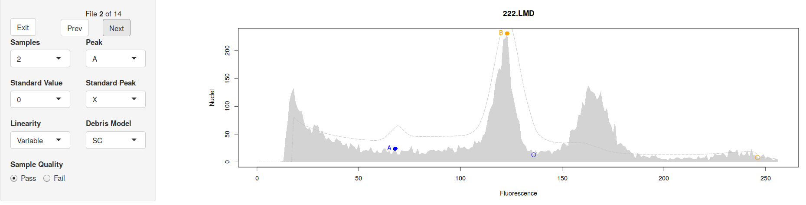
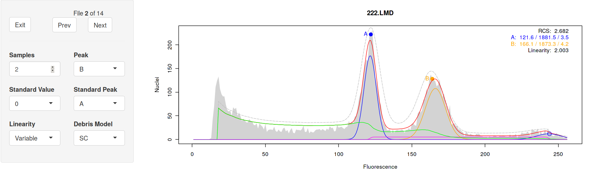
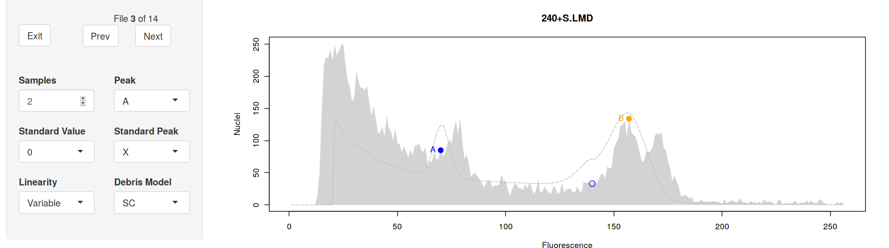
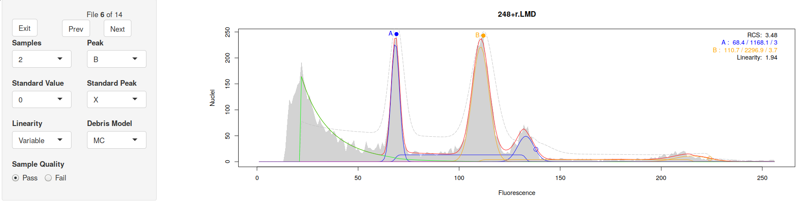
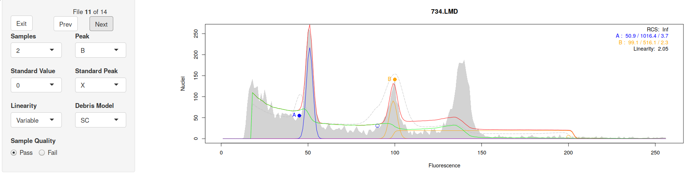
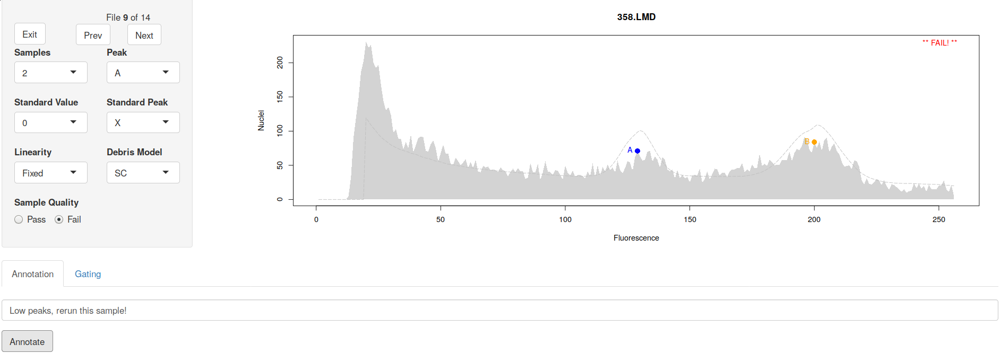

# Overview

This document provides a walk-through of the normal workflow for analyzing
flow cytometry (FCM) histograms with `flowPloidy`. See the vignette
"flowPloidy: Flow Cytometry Histograms" (aka "histogram-tour") for a
general overview of FCM histograms.

# Installation
## Stable Release
`flowPloidy` is part of the [BioConductor](bioconductor.org) repository.
You can install the stable version of the package directly from there.
First, install `bioconductor` in your `R` session:

```{r bioconductor, eval=FALSE}
if (!requireNamespace("BiocManager", quietly = TRUE))
  install.packages("BiocManager")
```

Then install `flowPloidy`:

```{r biocLite1, eval=FALSE}
BiocManager::install("flowPloidy", version = "devel")
```

The examples in this vignette, and the `flowPloidy` help files, use data in
the `flowPloidyData` package, which is also on BioConductor. (You don't
need `flowPloidyData` to use `flowPloidy` on your own data, only for the
examples).

```{r biocLite2, eval=FALSE}
BiocManager::install("flowPloidyData")
```

## Development Release

The Bioconductor system emphasizes stable packages. As a consequence,
updates are only released twice a year. If you need the latest version of
`flowPloidy`, you may prefer to use the developmental version. This is
available directly from the [GitHub](github.com) repository, but requires a
few more steps to install.

First, you need to install `bioconductor`, if you haven't already:

```{r bioconductor2, eval=FALSE}
install.packages("BiocManager")
```
Next, you'll need to install two dependencies from `bioconductor`:

```{r bioc-dependencies, eval = FALSE}
BiocManager::install("flowCore")
BiocManager::install("flowPloidyData")
```

You also need the `devtools` package, if you don't have it already:

```{r devtools, eval = FALSE}
install.packages("devtools", dependencies = TRUE)
```

Now you can use `devtools` to import the latest version of `flowPloidy`
direct from the repository:

```{r github, eval = FALSE}
library("devtools")
install_github("plantarum/flowPloidy", dependencies = TRUE,
               build_vignettes = TRUE)
```

This *should* install `flowPloidy` along with all its dependencies.
However, sometimes R gets confused and will complain about missing
packages, even though we've asked it to automatically install everything
that `flowPloidy` needs (i.e., `dependencies = TRUE`). If you see messages
in the terminal indicating a package name that isn't found, try installing
that package directly and then re-run the `install_github` line above. You
may need to repeat this process several times to get all the dependencies
installed.

# Loading the Package and Importing Data
You only need to install the package once (other than updating the package
to get new versions as they are released). Once that's done, you can load
it from your R session:

```{r flowPloidy}
library(flowPloidy)
```

Once you have the package loaded, you're ready to process your files.
You can load single files, but we usually process a directory-full of FCM
files at once. For the purposes of this tutorial, we'll use the sample
files provided in the `flowPloidyData` package, which we installed in the
previous section.

```{r flowPloidyData}
library(flowPloidyData)
```

After loading this package, you'll have access to the variable
`flowPloidyFiles`. This is a vector containing the full paths to the sample
data files on your system. Whenever we use it in the examples below, you
can substitute a vector containing the paths to your FCM data files.
Subsetting this variable (i.e., `flowPloidyFiles[1]`) produces a single
file name.

***

**NOTE**

To generate a list of your own files, use the R function `list.files()`.
For example, if all your files are the directory `~/flow/data/`, you can
create a vector containing your files with:

```{r list.files1, eval = FALSE}
my.files <- list.files("~/flow/data", full.names = TRUE)
```

If the directory contains additional files, you can provide a pattern to
match only your FCM files. For example, if your FCM files have the suffix
`.LMD`, you could use this:

```{r list.files2, eval = FALSE}
my.files <- list.files("~/flow/data", full.names = TRUE, pattern = ".LMD")
```

Once you've generated a list of files, you can pass it to `batchFlowHist`
as we do with `flowPloidyFiles` in the following example.

***

Before we can load our flow data, we need to know which channel to use for
our histogram. We can see a list of all channel names with the function
`viewFlowChannels`:

```{r viewFlowChannel, output = "hold"}
viewFlowChannels(flowPloidyFiles[1])
## or viewFlowcChannels("my-flow-file.LMD")
```

For our flow cytometer, the primary data channel is called "`FL3.INT.LIN`".
Knowing this, we can now import all the files in a directory with the
function `batchFlowHist()`:

```{r batchFlowHist, message = 1:10, collapse = TRUE, cache = TRUE}
batch1 <- batchFlowHist(flowPloidyFiles, channel = "FL3.INT.LIN")
```

[ ... output truncated to save space ...]

The output indicates that there were problems with some of the histograms
(i.e., `*** Model Fit Needs Attention ***`). This is expected, and we'll
correct the problems in the next step.

# Reviewing and Correcting Histogram Analyses

The function `browseFlowHist()` provides an interactive way to view and
correct our analyses. 

***

**IMPORTANT** 

To save your corrections, you need to store the output of this function in
a variable. For example `myresults <- browseFlowHist(batch1)` will store
the updated results in the variable `myresults`. It's often easiest to
update the analyses 'in place', assigning the output of `browseFlowHist()`
to the variable you pass to is as an argument, as in the following example.

***

```{r browseFlowHist, eval = FALSE}
batch1 <- browseFlowHist(batch1) ## update the histograms in batch1
```

\newpage

## Histogram presentation

Calling `browseFlowHist()` opens a window in your internet browser that
will display your histograms. The first one looks like this:

```{r, echo = FALSE, out.width = "100%"}
knitr::include_graphics("gsFigs/gs_browse1.png")
```

On the right we see the histogram. The graphical elements are:

* **shaded area:** the raw data
* **dotted gray line:** the initial model estimate
* **red line:** the fitted model
* **green line:** the fitted debris component
* **blue line:** the fitted components for the G1 and G2 peaks of sample A
* **orange line:** the fitted components for the G1 and G2 peaks of sample
    B (the G2 peak is not visible on this plot)
* **magenta line:** the fitted s-phase component for sample A (too small to
    see in this plot)
* **turquoise line:** the fitted s-phase component for sample B (too small
    to see in this plot)
* **purple line:** the fitted aggregate component (too small to see in this plot)

You also see coloured circles. These are the initial peak estimates, blue
for sample A, and orange for sample B. The solid circles are the G1
estimates, and there is a hollow circle to indicate the G2 peak (only
visible for sample A in this plot).

The upper right corner of the plot contains some additional information
regarding the model fit:

* **RCS:** the residual Chi-Square value. This is a rough goodness-of-fit
  value. @bagwell_1993 suggests that values between 0.7 and 4 indicate an
  acceptable model fit. See `?RCS` for more details in the online manual.
* **A** and **B:** the parameter estimates for samples A and B. The three
  numbers are the peak position, the number of nuclei counted, and the
  coefficient of variation.
* **Linearity:** The linearity parameter. This is the ratio between G1 and
  G2 peaks. By default, we fit it as a model parameter bounded between 1.5
  and 2.5[^1].

[^1]: Linearity should be 2, but local environmental conditions may cause
    your flow cytometer to drift, and it may vary between days, or even
    from the beginning to the end of a run. If you don't have G2 peaks in
    your data, it won't matter at all. In general, you can ignore this,
    unless you are interested in developing new model components (in which
    case, see `?ModelComponent`).

For this example, the default settings have worked perfectly. The model fit
is acceptable (RCS 1.59), and the CVs for the peaks are well below the
usual 5% threshold for acceptable.

One thing we don't see is an indication of which peak is the standard, and
which is our unknown sample. That is because `flowPloidy` doesn't know, and
has no way to infer this automatically. You will need to indicate this
yourself, based on your understanding of the expected peak sizes and
ratios, and perhaps running the standard on its own without an unknown. You
can tell `flowPloidy` which peak is the standard by selecting the value in
the "Standard Peak" drop-down selector, on the left side of the plot. By
default this is "X", indicating the standard has not been identified. If
you set it to "A" or "B", the value will be stored in the results. If you
don't set the value, you will still be able to recover the peak ratio from
your results, but will have to calculate the pg values yourself. We'll
return to this below.

We'll ignore the other options in the navigation panel for now (and the
gating interface below), but will discuss them further below. For now,
click the "Next" button to move on to the next histogram.

## Correcting a Failed Model Fit

The second histogram didn't work at all:

```{r, echo = FALSE, out.width = "100%"}

```

Since the model fitting failed, the plot shows only the raw data and the
initial estimates. The fitting parameters are also absent. 

Looking at the initial estimates, it's easy to see what went wrong - a
false peak in the noise near position 60 was incorrectly identified as a G1
peak. We can correct this by re-positioning the peak estimates. The "Peak"
drop-down list at the left allows you to select which peak to move, and
left-clicking on the plot will set the new position for that peak.

Moving Peak B to the second big peak, and Peak A to the first peak, the
analysis works as expected:

```{r, echo = FALSE, out.width = "100%"}

```

In most cases, the exact placement of the initial peak isn't critical. As
long as you put it somewhere near the top of the appropriate peak,
`flowPloidy` will be able to find the true value. You can confirm this by
clicking around within the peaks: you end up with the same result (within a
small rounding error) for quite a range of initial peak positions.

Note that the A peak must have a lower mean (i.e., be further left on the
histogram) than the B peak. If you try to put the A peak above the B peak,
`flowPloidy` will swap them around for you, to make the lower peak A and
the upper peak B. This is necessary for some of the internal model-fitting
code to work properly.

## Changing Model Components: Debris Model

Moving on to histogram 6, "248+r.LMD", we see that the model fit succeeded, and the fitted components are added to our plot: 

```{r, echo = FALSE, out.width = "100%"}

```

However, the RCS value is very high - 2553! Looking at the model
components, notice the gap between the raw data and the fitted between the
G1 peaks for A and B (between 75 and 100). The largest fitted component in
this region is the green debris curve. By default, it uses the Single-Cut
model. We can change to the Multi-Cut model by selecting "MC" from the
drop-down list under "Debris Model" in the control panel at the left. 

```{r, echo = FALSE, out.width = "100%"}

```

With the Multi-Cut debris model, we have a much more sensible RCS value.
You can also see the improved fit visually - note the top of the fitted
model is much closer to the raw data with the "MC" debris model, especially
in the region between 80 and 140.

The most appropriate way to model histogram debris varies for different
samples. As botanists, we will analyze samples from many different species,
tissue types, and using different preparation protocols. In some cases, the
Single Cut debris model will be most effective; in others, the Multi-Cut
model works better. When your analysis produces high RCS values, as in this
case, it may be a clue that the other debris model is more appropriate.

For the nitty-gritty details of the debris models, see `?DebrisModels`. In
practice, use whichever one gives you a lower RCS value. Also keep in mind
that there is usually only a very small difference between the two options
when it comes to peak means and CVs, even if the difference in RCS can be
very large. Note also that RCS is sensitive to a number of factors, not all
of which are related to model fit (see `?RCS`). So getting a very high RCS
value doesn't necessarily mean you can't use your data; use your judgement,
and if in doubt, re-run the sample.

## Local Minima Traps

Despite its power, non-linear regressions can get stuck in 'local minima'.
Unlike linear regression, there is no single unique solution to a
non-linear regression. Fitting a model requires testing out different
parameters before determining which combination is best. Sometimes, the
algorithm gets stuck on incorrect parameters. Luckily, this is usually
easily detected by humans.

An example is file 11, "`734.LMD`" in our sample data:

```{r, echo = FALSE, out.width = "100%"}

```

The real G1 Peak for sample B has been ignored, but the model 'succeeded'
anyways. The RCS value is `Inf` (infinity), which is another clue that
something has gone wrong here. 

Once again, we need to correct our peak estimates. If we move the B peak
over we get the following fit:

```{r, echo = FALSE, out.width = "100%"}
knitr::include_graphics("gsFigs/gs_browse11b.png")
```

That's better - the model has fit all the peaks in our data, and the RCS
value has come back down to an acceptable value. You need to be aware of
these problems, and visually confirm the model fit for each of your
histograms.

## Annotating Histograms and Excluding Results

You may encounter a histogram that is successfully fit by `flowPloidy`,
that you want to exclude from your data. Maybe it had extra peaks (such as
from contaminants), or `flowPloidy` has fit peaks that you suspect are just
noise in the debris. In cases like this, you can select the `Fail` button
under the `Sample Quality` option on the control panel. This option instructs
`flowPloidy` to exclude model fit data for this sample when exporting the
results. 

When you do this, you may want to leave yourself a note. That's what the
`Annotation` box at the bottom of the histogram is for. You can enter any
text you like in this box, and after you press the **Annotation button**,
it will be stored with that histogram, and included when you export the
results (next section).

```{r, echo = FALSE, out.width = "100%", fig.cap = "Annotating a Failed Histogram"}

```

# Exporting Results

After you've reviewed your analyses, you'll want to export the results. To
do this, you need to return to the R console. Click the `Exit` button in
the upper-left corner of the navigation panel. 

This will close the interactive GUI - you can now close that browser tab.
**Do not close the browser tab without clicking exit!** If you do so,
you'll lose all your corrections.

You may also have noticed that while you're reviewing your histograms in
the browser, your R console is busy. You can't interact with the R console
until you've exited from the histogram browser. Should you accidentally
close your browser tab without exiting, entering `C-c` in the R console
should restore the console (without saving the edits you made!). Note this
is what I do on Linux, for Windows and Mac you may need to use a different
key to cancel the browser loop. If you are using RStudio, there's a little
red "stop sign" button at the top of the console window you can click.

Assuming we've made all of our edits and exited cleanly from the browser
window, the updated histogram data is now stored in our variable. We can
retrieve a summary table with the function `tabulateFlowHist()`:

```{r tabulateFlowHist}
tabulateFlowHist(batch1)[1:4, ]
```

To save space, I've limited the output to the first four samples. Also, due
to the way vignettes are generated, these are the uncorrected model fits.
Your output may differ depending on the changes you made in the interactive
browser.

The columns in this table may include:

* **StdPeak:** which peak (A or B) was the standard (only present if you indicated which peak was the standard using the `Standard Peak` dropdown, see below) 
* **ratio:** the ratio of the sample size/standard size (also not always present, see below)
* **StdSize:** the size of the standard, if known (discussed below)
* **pg:** the estimated genome content for the unknown sample. Requires
  that the standard peak is identified, and the standard size has been set
  (see below)
* **RCS:** the Residual Chi-Square value
* **<S>_mean:** the peak size for each sample <S>
* **<S>_stddev:** the standard deviation for the G1 peak of sample <S>
* **<S><N>_count:** the number of nuclei modeled for the G<N> peak of
  sample <S>. e.g., the number of nuclei in the G2 peak of sample B is
  `b2_count` and B (and C, in cases where three samples are co-chopped
  together)
* **<S>_s_count:** the number of nuclei modeled for the s-phase of sample <S>
* **<S>_CV:** the coefficient of variation for the G1 peak of sample <S>
* **linearity:** the linearity parameter (see below)

Note that the actual columns present will depend on your analysis. You
can't count on the columns being in a particular order, so reference them
by name, not number.

Printing this table to your console isn't very useful. You'll probably want
to store it in a variable, so you can extract the values for further
analysis:

```{r tabulateFlowHist2, eval = FALSE}
results <- tabulateFlowHist(batch1)
```

Additionally, if you include a `file` argument, the table will be saved in
`csv` format to that file:

```{r tabulateFlowHist3, eval = FALSE}
results <- tabulateFlowHist(batch1, file = "FCMresults.csv")
```

At this point, you have your raw FCM data files, as produced by your flow
cytometer, and you have the results of your histogram analyses. You don't
have a permanent record of the actual model fits. If you want that, you'll
need to save the object returned from `browseFlowHist()`. 

```{r saving FlowHist objects, eval = FALSE}
save(batch1, file = "my-FCM-analyses.Rdata")
```

Note that this is a binary file format - you'll need to open it in R to
access the data. We don't normally do this, as the `FlowHist` objects can
be quite large, and if we need to we can quickly reload and review any
histogram from the raw data files.

# Size Standards

Up to this point, we've largely ignored size standards. There are three
ways to incorporate size standards into your `flowPloidy` analysis.

You could ignore them entirely, as we have so far. If you do, the data
returned by `tabulateFlowHist()` will include only the relative G1 peak
positions for your samples, from which you can determine which one is the
standard, based on the expected ratios for your study. This is a bit
tedious.

A better option is telling `flowPloidy` the size of your standard when you
load your files. You do this by providing the appropriate value of the
standard as the `standards` argument to `batchFlowHist()`. For example, if
we used _Raphananus sativus_ Saxa, (genome size 1.11pg) as our standard,
we'd call `batchFlowHist()` as:

```{r setting standards, eval = FALSE}
batch1 <- batchFlowHist(flowPloidyFiles, channel = "FL3.INT.LIN",
                        standards = 1.11)
```

This will set the standard size to 1.11pg for all samples. If there are any
samples in the batch that use a different standard, or that you wish to
exclude from automatic generation of the pg value for any reason, you can
manually set the standard size to `0` to indicate this. You will still need
to identify which peak is the standard. Once you've done that, the pg value
will be calculated for you when you run `tabulateFlowHist()`.

If you have used more than one standard for different samples in batch, you
can pass a vector of all the possible standard values to `batchFlowHist()`.
For example, if some of your samples used _Raphananus sativus_ Saxa, and
others used _Pisum sativum_ Ctirad (9.09pg), we'd call `batchFlowHist()`
as:

```{r multiple standards, eval = FALSE}
batch1 <- batchFlowHist(flowPloidyFiles, channel = "FL3.INT.LIN",
                        standards = c(1.11, 9.09))
```

Called like this, when you use `browseFlowHist()` the `Standard Value`
dropdown list will have three options: 0 (for samples that you don't wish
to have the pg value calculated), 1.11, and 9.09. Once again, any samples
for which you have set the Standard Value and identified the Standard Peak
will have the pg values calculated when you call `tabulateFlowHist()`.

# Gating

One of our main motivations in writing `flowPloidy` was to minimize the
need for gating data prior to analysis. Gating is unavoidably subjective,
particularly as the approach to gating used in a particular study is rarely
described in much (or any) detail.

That said, for some species it is unavoidable. The following example
illustrates one such case, _Vaccinium oxycoccos_. As you'll see, the
G1 peaks in this species are typically obscured by large amounts of debris.
With some relatively straightforward gating, however, we can still use the
model-fitting approach to determining genome size.

We'll use a single file for this example: `fpVac`. Again, this is provided
by the `flowPloidyData` package. As before, we start by determining
the correct data channel to use:

```{r vac channel}
viewFlowChannels(fpVac)
```

This data came from a different flow cytometer, so here we'll use the
"`FL2.A`" channel:

```{r read vac}
vac <- batchFlowHist(fpVac, channel = "FL2.A")
```

Now we can take a look at the histogram:

```{r view vac, eval = FALSE}
vac <- browseFlowHist(vac)
```

```{r, echo = FALSE, out.width = "100%"}
knitr::include_graphics("gsFigs/vac1.png")
```

That's terrible. The debris curve has completely obscured the histogram. To
correct this we'll need to apply a gate, using the interface we've ignored
up to now. 

## The Gating Interface

At the bottom of the browser window, click the `Gating` tab, and you'll see
this:

```{r, echo = FALSE, out.width = "100%"}
knitr::include_graphics("gsFigs/gate_ui.png")
```

At the left side is a simple control panel. We can select the X and Y
variables using the dropdown menus. All of the data channels in your raw
data are available. The zoom slider allows you to zoom in on the lower
portion of the plot.

The `Y axis` dropdown allows you to toggle between two plotting
relationships. `Y/X` plots your chosen X channel on the X axis, and the
ratio of the Y and X channels on the Y axis. This is often useful in
'straightening out' the plot, making it easier to see the boundaries
between cell populations. If you prefer, you can set the `Y axis` drop down
to `Y` instead, which will give you the usual Y ~ X plot.

Using the Y/X ratio is also useful in this context, because the interface
we're using (built with the R Shiny package) only allows for rectangular
selections. So 'straightening out' our plot simplifies fitting our
target points into a rectangular space.

The final element on the control panel is the `Set Gate` button. Clicking
that will apply the current gate to our data (or remove an existing gate if
none is selected).

## Interpreting the Gate Plot

On the lower right we have three plot windows. The left-most is the actual
gate window, which displays the raw data. The middle window is a preview of
the raw data after the gate is applied. The right-most window shows the
gate 'residuals', the complement of the middle window - it shows a
histogram of all the observations that are *excluded* by the gate.

The plot we're most interested in is the one on the left. For most of our
gating, we set the X-axis to the fluorescence data channel; in this case
that's `FL2.A`. We plot side scatter (actually, the ratio side
scatter/fluorescence) on the Y-axis. 

The amount of fluorescence emitted by each particle tells us how much dye
they have incorporated; we expect clusters corresponding to the G1 nuclei
of our sample and the standard. There may also be clusters for the G2
nuclei. This is exactly what we saw in the previous examples where we
didn't need gating: the unaltered histograms were clear enough to fit our
model and extract the parameters we need to determine genome size.

In this case, we have a lot of debris particles that are emitting the same
fluorescence intensities as our intact nuclei, so we need another parameter
to separate them. That's where side scatter comes in. Side scatter is a
measure of 'optical complexity' or 'granularity'. Simply put, it tells us
something about the shape of the particles. And our nuclei will have a
characteristic shape. Typically, this shape has lower 'optical complexity'
than the irregular debris particles.

In order to see this, we'll need to zoom in on the gate plot. Dragging the
zoom slider about halfway across[^2] we see this:

[^2]: The zoom slider numbers aren't particularly meaningful in themselves;
    higher numbers mean a higher zoom, measured on a log scale.

```{r, echo = FALSE, out.width = "100%"}
knitr::include_graphics("gsFigs/gs_gate.png")
```

Notice the dense cloud of points on the upper left. These particles have
low fluorescence and high granularity. They could be bits of damaged
nuclei, or irregularly-shaped cell components that are weakly fluorescent
in the FCM laser. This is the debris we need to exclude.

When we do, we'll uncover our intact nuclei, which are visible along the
bottom of the plot in three discrete clusters. The two near the center of
the X-axis are the G1 peaks for the sample and standard. The smaller
cluster further right is the G2 peak for the standard. Zooming in further
we can see these more clearly:

```{r, echo = FALSE, out.width = "100%"}
knitr::include_graphics("gsFigs/gs_gate_zoom2.png")
```

Here, notice that the nuclei form tight, dark clusters, with particles
trailing away upwards. Those upward 'side-scatter tails' are probably
intact nuclei with bits of debris or fluorescent compounds stuck to them.
This makes their shapes more irregular, increasing their side scatter
values. Unfortunately, there is no clear dividing line between 'clean
nuclei' and 'goopy nuclei'. 

In practice, we place our gates high enough to retain all the particles in
the densest section of the clusters, and extend them upwards to include the
bottom portion of the tails. There is an element of subjectivity here: we
are balancing biasing our results with goopy nuclei by including too much
of the tail, and reducing the amount of precious data in the analysis by
being too aggressive with our gate. Including more of the goopy nuclei
increases our CV, and excluding them lowers our cell count.

## Applying a Gate

Use the mouse to left-click and drag a box around the cell clouds:

```{r, echo = FALSE, out.width = "100%"}
knitr::include_graphics("gsFigs/draw_gate.png")
```

The upper boundary of the gate is important - it will have a direct
influence on both our cell counts and CVs. However, the left and right
boundaries have very little impact. The model-fitting process does a very
nice job of determining where our peaks start and stop, so we don't need to
worry about drawing 'correct' boundaries on the left and right.
Consequently, we set our gates to include the full width of the plot.

We can see the effect of the gate in the middle window, and the events that
we're excluding in the right window. At this point, we can see three peaks
in the histogram preview. To apply this gate to the analysis, click the
`Set Gate` button. The result should look something like this:

```{r, echo = FALSE, out.width = "100%"}
knitr::include_graphics("gsFigs/gated_analysis.png")
```

The histogram plot now includes the **--GATED--** flag. This is a caution
to remind us that applying a gate may influence the model-fitting process
in a number of ways, including how effective the debris model components
(SC and MC) capture the remaining debris, and the absolute value of RCS. In
general, these issues are outweighed by the improved fit for high-debris
samples. See `?DebrisModels` for further discussion.

The final outcome here is we have a usable result. Sadly for those of us
working with _Vaccinium_, we're usually limited to very low cell counts.
But given the challenges presented by this difficult tissue, we have
succeeded in isolating the nuclei necessary to get a GC estimate.

# Further Details

Additional documentation is provided in the built-in R manuals.
`?flowPloidy` provides links to all the help files.

# References
