# Overview

This document provides a walk-through of the normal workflow for analyzing
flow cytometry (FCM) histograms with `flowPloidy`. See the vignette
"flowPloidy: Flow Cytometry Histograms" for a general overview of FCM
histograms.

# Installation
## Stable Release
`flowPloidy` is part of the [BioConductor](bioconductor.org) repository.
You can install the stable version of the package directly from there.
First, install `bioconductor` in your `R` session:

```{r bioconductor, eval=FALSE}
source("https://bioconductor.org/biocLite.R")
biocLite()
```

Then install `flowPloidy`:

```{r biocLite1, eval=FALSE}
biocLite("flowPloidy")
```

The examples in this vignette, and the `flowPloidy` help files, use data in
the `flowPloidyData` package, which is also on BioConductor. (You don't
need `flowPloidyData` to use `flowPloidy` on your own data, only for the
examples).

```{r biocLite2, eval=FALSE}
biocLite("flowPloidyData")
```

## Development Release

The Bioconductor system emphasizes stable packages. As a consequence,
updates are only released twice a year. At the moment (March, 2017),
`flowPloidy` development is proceeding at a faster rate. Consequently, you
may prefer to use the developmental version. This is available directly
from the [GitHub](github.com) repository, but requires a few more steps to
install.

First, you need to install `bioconductor`, if you haven't already:

```{r bioconductor2, eval=FALSE}
source("https://bioconductor.org/biocLite.R")
biocLite()
```
Next, you'll need to install two dependencies from `bioconductor`:

```{r bioc-dependencies, eval = FALSE}
biocLite("flowCore")
biocLite("flowPloidyData")
```

You also need the `devtools` package, if you don't have it already:

```{r devtools, eval = FALSE}
install.packages("devtools", dependencies = TRUE)
```

Now you can use `devtools` to import the latest version of `flowPloidy`
direct from the repository:

```{r github, eval = FALSE}
library("devtools")
install_github("plantarum/flowPloidy", dependencies = TRUE,
               build_vignettes = TRUE)
```

This *should* install `flowPloidy` along with all its dependencies.
However, sometimes R gets confused and will complain about missing
packages, even though we've asked it to automatically install everything
that `flowPloidy` needs (i.e., `dependencies = TRUE`). If you see messages
in the terminal indicating a package name that isn't found, try installing
that package directly and then re-run the `install_github` line above. You
may need to repeat this process several times to get all the dependencies
installed.

# Loading the Package and Importing Data
You only need to install the package once (other than updating the package
to get new versions as they are released). Once that's done, you can load
it from your R session:

```{r flowPloidy}
library(flowPloidy)
```

Once you have the package loaded, you're ready to process your files.
You can load single files, but we usually process a directory-full of FCM
files at once. For the purposes of this tutorial, we'll use the sample
files provided in the `flowPloidyData` package, which we installed in the
previous section.

```{r flowPloidyData}
library(flowPloidyData)
```

After loading this package, you'll have access to the variable
`flowPloidyFiles`. This is a vector containing the full paths to the sample
data files on your system. Whenever we use it in the examples below, you
can substitute a vector containing the paths to your FCM data files.
Subsetting this variable (i.e., `flowPloidyFiles[1]`) produces a single
file name.

***

**NOTE**

To generate a list of your own files, use the R function `list.files()`.
For example, if all your files are the directory `~/flow/data/`, you can
create a vector containing your files with:

```{r list.files1, eval = FALSE}
my.files <- list.files("~/flow/data", full.names = TRUE)
```

If the directory contains additional files, you can provide a pattern to
match only your FCM files. For example, if your FCM files have the suffix
`.LMD`, you could use this:

```{r list.files2, eval = FALSE}
my.files <- list.files("~/flow/data", full.names = TRUE, pattern = ".LMD")
```

Once you've generated a list of files, you can pass it to `batchFlowHist`
as we do with `flowPloidyFiles` in the following example.

***

Before we can load our flow data, we need to know which channel to use for
our histogram. We can see a list of all channel names with the function
`viewFlowChannels`:

```{r viewFlowChannel, output = "hold"}
viewFlowChannels(flowPloidyFiles[1])
## or viewFlowcChannels("my-flow-file.LMD")
```

For our flow cytometer, the primary data channel is called "`FL3.INT.LIN`".
Knowing this, we can now import all the files in a directory with the
function `batchFlowHist()`:

```{r batchFlowHist, message = 1:10, collapse = TRUE, cache = TRUE}
batch1 <- batchFlowHist(flowPloidyFiles, channel = "FL3.INT.LIN")
```

[ ... output truncated to save space ...]

The output indicates that there were problems with some of the histograms
(i.e., `*** Model Fit Needs Attention ***`). This is expected, and we'll
correct the problems in the next step.

# Reviewing and Correcting Histogram Analyses

The function `browseFlowHist()` provides an interactive way to view and
correct our analyses. 

***

**IMPORTANT** 

To save your corrections, you need to store the output of this function in
a variable. For example `myresults <- browseFlowHist(batch1)` will store
the updated results in the variable `myresults`. It's often easiest to
update the analyses 'in place', assigning the output of `browseFlowHist()`
to the variable you pass to is as an argument, as in the following example.

***

```{r browseFlowHist, eval = FALSE}
batch1 <- browseFlowHist(batch1)
```

\newpage

## Histogram presentation

Calling `browseFlowHist()` opens a window in your internet browser that
will display your histograms. The first one looks like this:


On the right we see the histogram. The graphical elements are:

* **shaded area:** the raw data
* **dotted gray line:** the initial model estimate
* **red line:** the fitted model
* **green line:** the fitted debris component
* **blue line:** the fitted components for the G1 and G2 peaks of sample A
* **orange line:** the fitted components for the G1 and G2 peaks of sample
    B (the G2 peak is not visible on this plot)
* **magenta line:** the fitted s-phase component for sample A (too small to
    see in this plot)
* **turquoise line:** the fitted s-phase component for sample B (too small
    to see in this plot)
* **purple line:** the fitted aggregate component (a very small peak 
    around 240)

You also see coloured circles. These are the initial peak estimates, blue
for sample A, and orange for sample B. The solid circles are the G1
estimates, and there is a hollow circle to indicate the G2 peak (only
visible for sample A in this plot).

The upper right corner of the plot contains some additional information
regarding the model fit:

* **RCS:** the residual Chi-Square value. This is a rough goodness-of-fit
  value. @bagwell_1993 suggests that values between 0.7 and 4 indicate an
  acceptable model fit. See below for further discussion.
* **A and B:** the parameter estimates for samples A and B. The three
  numbers are the peak position, the number of nuclei counted, and the
  coefficient of variation.
* **Linearity:** The linearity parameter, discussed further below.

For this example, the default settings have worked perfectly. The model fit
is acceptable (RCS 2.208), and the CVs for the peaks are well below the
usual 5% threshold for acceptable.

One thing we don't see is an indication of which peak is the standard, and
which is our unknown sample. That is because `flowPloidy` doesn't know, and
has no way to infer this automatically. You will need to indicate this
yourself, based on your understanding of the expected peak sizes and
ratios, and perhaps running the standard on its own without an unknown. You
can tell `flowPloidy` which peak is the standard by selecting the value in
the "Standard Peak" drop-down selector, on the left side of the plot. By
default this is "X", indicating the standard has not been identified. If
you set it to "A", the value will be stored in the results. If you don't
set the value, you will still be able to recover the peak ratio from your
results.

On the left side of the plot is the navigation panel. We will ignore the
various options for now, but will discuss them further below. For now,
click the "Next" button to move on to the next histogram.

## Correcting a Failed Model Fit

The second histogram didn't work at all:

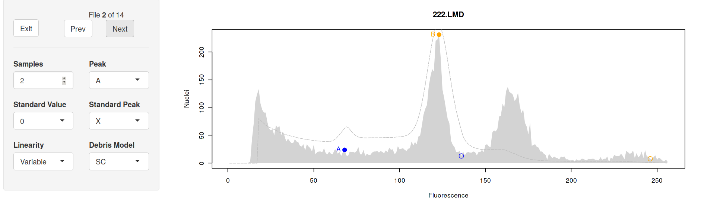

Since the model fitting failed, the plot shows only the raw data and the
initial estimates. The fitting parameters are also absent. 

Looking at the initial estimates, it's easy to see what went wrong - a
false peak in the noise near position 60 was incorrectly identified as a G1
peak. We can correct this by re-positioning the peak estimates. The "Peak"
drop-down list at the left allows you to select which peak to move, and
left-clicking on the plot will set the new position for that peak.

Moving Peak B to the second big peak, and Peak A to the first peak, the
analysis works as expected:


Note that the A peak must have a lower mean (i.e., be further left on the
histogram) than the B peak. If you try to put the A peak above the B peak,
`flowPloidy` will swap them around for you, to make the lower peak A and
the upper peak B. This is necessary for some of the internal model-fitting
code to work properly.

## Changing Model Components: Debris Model

Moving on to the next histogram, we see that there were also problems with
peak detection here:


We can fix this the same way:

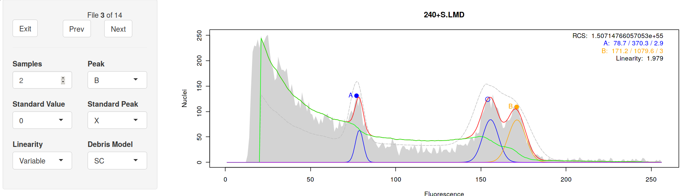

Quick and easy. However, our RCS value is now off the charts! Two things
are contributing to this. First, as we'll discuss below, RCS is sensitive
to a number of factors, not all of which are related to model fit. Second,
the most appropriate way to model histogram debris varies for different
samples. As botanists, we will analyze samples from many different species,
tissue types, and using different preparation protocols. In some cases, the
Single Cut debris model will be most effective; in others, the Multi-Cut
model works better. When your analysis produces high RCS values, as in this
case, it may be a clue that the other debris model is more appropriate. We
can check this by selecting "MC" from the "Debris Model" drop-down list at
the left:


With the Multi-Cut debris model, we have a much more sensible RCS value.
You can also see the improved fit visually - note the top of the fitted
model is much closer to the raw data with the "MC" debris model, especially
in the region between 80 and 140.

## Local Minima Traps

Despite its power, non-linear regressions can get stuck in 'local minima'.
Unlike linear regression, there is no single unique solution to a
non-linear regression. Fitting a model requires testing out different
parameters before determining which combination is best. Sometimes, the
algorithm gets stuck on incorrect parameters. Luckily, this is usually
easily detected by humans.

An example is file 11, "`734.LMD`" in our sample data:

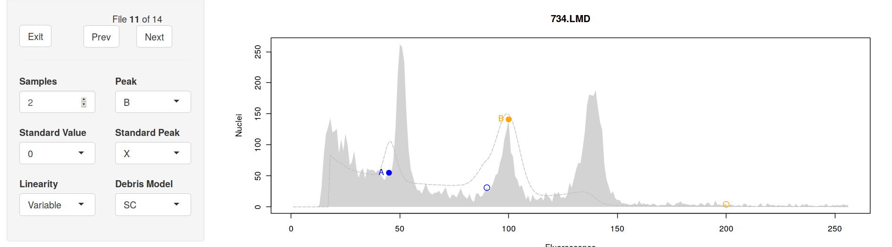

Once again, we need to correct our peak estimates. If we move the B peak
over we get the following fit:


Other than the RCS value being a little high, the stats for this fit look
ok. However, notice that the G2 peak for sample A doesn't match well with
the raw data. That's strange, as the G1 peak looks fine, as does the sample
B peak. This is an example of the model getting trapped in a local minima.

We can fix this by changing the initial estimates. Notice the initial
estimate for the A peak is actually stuck on a 'noise' peak just below the
real peak. If we shift that point closer to the true peak, we get a more
sensible fit:


The new fit is much better, and our RCS value is now down below 4 where we
like to see it. Notice, however, that the parameters of most interest (peak
position, cell count, and CV) don't change appreciably; if we hadn't
noticed this problem, our results would have been nearly identical.

# Exporting Results

After you've reviewed your analyses, you'll want to export the results. To
do this, you need to return to the R console. Click the `Exit` button in
the upper-left corner of the navigation panel. 

This will close the interactive GUI - you can now close that browser tab.
**Do not close the browser tab without clicking exit!** If you do so,
you'll lose all your corrections.

You may also have noticed that while you're reviewing your histograms in
the browser, your R console is busy. You can't interact with the R console
until you've exited from the histogram browser. Should you accidentally
close your browser tab without exiting, entering `C-c` in the R console
should restore the console (without saving the edits you made!). Note this
is what I do on Linux, for Windows and Mac you may need to use a different
key to cancel the browser loop.

Assuming we've made all of our edits and exited cleanly from the browser
window, the updated histogram data is now stored in our variable. We can
retrieve a summary table with the function `tabulateFlowHist()`:

```{r tabulateFlowHist}
tabulateFlowHist(batch1)[1:4, ]
```

To save space, I've limited the output to the first four samples. Also, due
to the way vignettes are generated, these are the uncorrected model fits.
Your output may differ depending on the changes you made in the interactive
browser.

The columns in this table are:

* **channel:** the data channel used for the histogram
* **components:** the components included in the model (discussed in more
  depth in another vignette)
* **totalEvents:** the total number of events in the raw data
* **standard:** the size of the standard, if known (discussed below)
* **stdpeak:** the standard peak (i.e., A or B, or NA if not set)
* **counts<N>:** the number of nuclei modeled for the G1 peaks of samples A
  and B (and C, in cases where three samples are co-chopped together)
* **size<N>:** the peak size for each sample
* **cv<N>:** the coefficient of variation for the G1 peak of each sample
* **AB:** the ratio of the G1 peaks A/B
* **ABse:** the standard error of the A/B peak ratio (discussed below)
* **AC, BC:** if a third sample is included, the peak ratios and SE for
  these comparisons
* **rcs:** the Residual Chi-Square value
* **linearity:** the linearity parameter (see below)
* **pg:** the estimated genome content for the unknown sample. Requires
  that the standard peak is identified, and the standard size has been set
  (see below)

Printing this table to your console isn't very useful. You'll probably want
to store it in a variable, so you can extract the values for further
analysis:

```{r tabulateFlowHist2, eval = FALSE}
results <- tabulateFlowHist(batch1)
```

Additionally, if you include a `file` argument, the table will be saved in
`csv` format to that file:

```{r tabulateFlowHist3, eval = FALSE}
results <- tabulateFlowHist(batch1, file = "FCMresults.csv")
```

At this point, you have your raw FCM data files, as produced by your flow
cytometer, and you have the results of your histogram analyses. You don't
have a permanent record of the actual model fits. If you want that, you'll
need to save the object returned from `browseFlowHist()`. 

```{r saving FlowHist objects, eval = FALSE}
save(batch1, file = "my-FCM-analyses.Rdata")
```

Note that this is a binary file format - you'll need to open it in R to
access the data. We don't normally do this, as the FlowHist objects can be
quite large, and if we need to we can quickly reload and review any
histogram from the raw data files.

# Size Standards

Up to this point, we've largely ignored size standards. There are two and a
half different ways to incorporate size standards into your `flowPloidy`
analysis. You could ignore them entirely. If you do, the data returned by
`tabulateFlowHist()` will include only the relative G1 peak positions for
your samples, from which you can determine which one is the standard, based
on the expected ratios for your study. This is a bit tedious.

A better option is telling `flowPloidy` the size of your standard when you
load your files. You do this by providing the appropriate value of the
standard as the `standards` argument to `batchFlowHist()`. For example, if
we used _Raphananus satuvus_ Saxa, (genome size 1.11pg) as our standard,
we'd call `batchFlowHist()` as:

```{r setting standards, eval = FALSE}
batch1 <- batchFlowHist(flowPloidyFiles, channel = "FL3.INT.LIN",
                        standards = 1.11)
```

This will set the standard size to 1.11pg for all samples. If there are any
samples in the batch that use a different standard, or that you wish to
exclude from automatic generation of the pg value for any reason, you can
manually set the standard size to `0` to indicate this. You will still need
to identify which peak is the standard. Once you've done that, the pg value
will be calculated for you when you run `tabulateFlowHist()`.

If you have used more than one standard for different samples in batch, you
can pass a vector of all the possible standard values to `batchFlowHist()`.
For example, if some of your samples used _Raphananus satuvus_ Saxa, and
others used _Pisum sativum_ Ctirad (9.09pg), we'd call `batchFlowHist()`
as:

```{r multiple standards, eval = FALSE}
batch1 <- batchFlowHist(flowPloidyFiles, channel = "FL3.INT.LIN",
                        standards = c(1.11, 9.09))
```

Called like this, when you use `browseFlowHist()` the `Standard Value`
dropdown list will have three options: 0 (for samples that you don't wish
to have the pg value calculated), 1.11, and 9.09. Once again, any samples
for which you have set the Standard Value and identified the Standard Peak
will have the pg values calculated when you call `tabulateFlowHist()`.

# Gating

One of our main motivations in writing `flowPloidy` was to minimize the
need for gating data prior to analysis. Gating is unavoidably subjective,
particularly as the approach to gating used in a particular study is rarely
described in much (or any) detail.

That said, for some species it is unavoidable. The following example
illustrates one such case, _Vaccinium oxycoccos_. As you'll see, the
G1 peaks in this species are typically obscured by large amounts of debris.
With some relatively straightforward gating, however, we can still use the
model-fitting approach to determining GC content.

We'll use a single file for this example: `fpVac`. Again, this is provided
by the `flowPloidyData` package. As before, we start by determining
the correct data channel to use:

```{r vac channel}
viewFlowChannels(fpVac)
```

This data came from a different flow cytometer, so here we'll use the
"`FL2.A`" channel:

```{r read vac}
vac <- batchFlowHist(fpVac, channel = "FL2.A")
```

Now we can take a look at the histogram:

```{r view vac, eval = FALSE}
vac <- browseFlowHist(vac)
```

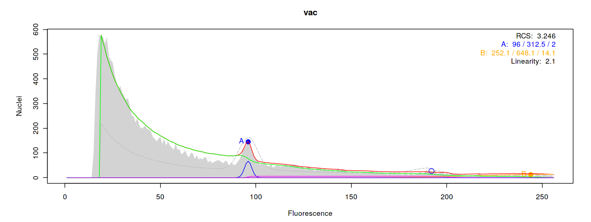

That's terrible. The debris curve has completely obscured the histogram. To
correct this we'll need to apply a gate, using the interface we've ignored
up to now. 

## The Gating Interface

At the bottom of the browser window you'll see this:

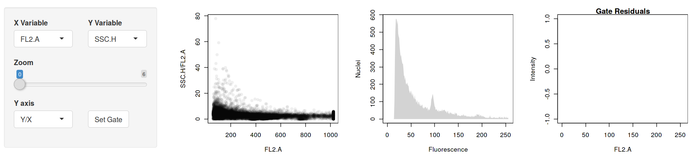

At the left side is a simple control panel. We can select the X and Y
variables using the dropdown menus. All of the data channels in your raw
data are available. The zoom slider allows you to zoom in on the lower
portion of the plot.

The `Y axis` dropdown allows you to toggle between two plotting
relationships. `Y/X` plots your chosen X channel on the X axis, and the
ratio of the Y and X channels on the Y axis. This is often useful in
'straightening out' the plot, making it easier to see the boundaries
between cell populations. If you prefer, you can set the `Y axis` drop down
to `Y` instead, which will give you the usual Y ~ X plot.

Using the Y/X ratio is also useful in this context, because the interface
we're using (built with the R Shiny package) only allows for rectangular
selections. So 'straightening out' our plot simplifies fitting our
target points into a rectangular space.

The final element on the control panel is the `Set Gate` button. Clicking
that will apply the current gate to our data (or remove an existing gate if
none is selected).

On the lower right we have three plot windows. The left-most is the actual
gate window, which displays the raw data. The middle window is a preview of
the raw data after the gate is applied. The right-most window shows the
gate 'residuals', the complement of the middle window - it shows a
histogram of all the observations that are *excluded* by the gate.

## Applying a Gate

For this sample, we will use the `FL2.A` channel for the X axis, and the
`SSC.H` channel for the Y axis, with the Y axis displayed as `Y/X`. Zooming
the slider to `3`[^1], we can see a clear separation between our (meager)
nuclei populations, and the looming dark cloud of debris.

[^1]: The zoom slider numbers aren't particularly meaningful in themselves;
    higher numbers mean a higher zoom, measured on a log scale.

Use the mouse to left-click and drag a box around the cell clouds:

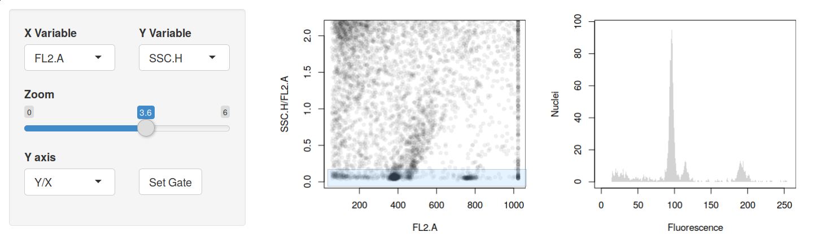

We can see the effect of the gate in the middle window, and the events that
we're excluding in the right window. At this point, we can see three peaks
in the histogram preview. To apply this gate to the analysis, click the
`Set Gate` button. The result should look something like this:

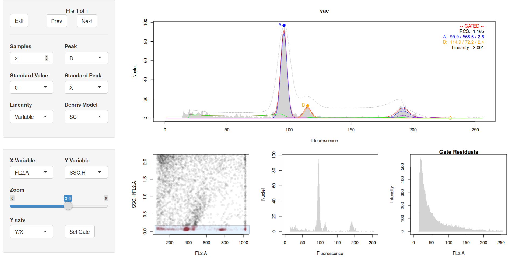

The histogram plot now includes the **--GATED--** flag. This is a caution
to remind us that applying a gate may influence the RCS value in unexpected
ways, so the absolute value may not be so useful now.

We originally analyzed this sample by manually gating the two peaks in
CellQuest, before we had developed `flowPloidy` to allow us to combine
manual gating and model-fitting. It is interesting to compare the results
of the two analyses:

parameter      flowPloidy CellQuest
-------------- ---------- ---------
Peak Ratio     1.23       1.26
pg             2.41       2.46
Sample CV      9.7        4.1
Sample Count   413.5      209
Standard CV    2.8        4.09
Standard Count 586.6      696

The sample CV for the CellQuest analysis is much lower than `flowPloidy`.
This is a consequence of the manual gating approach. By applying hard gates
to each peak, CellQuest artificially excludes nuclei in the peak tails,
which will directly reduce the CVs below their true values, particularly
when two peaks are close together as in this case. The CVs reported by
`flowPloidy` are more accurate in this respect.

On the other hand, the standard CV is lower in `flowPloidy`. This is likely
a consequence of some of the debris and s-phase nuclei getting collected in
the gate applied to the standard in the CellQuest analysis, inflating the
CV. 

In addition, `flowPloidy` counted more nuclei in the sample peak than
CellQuest. The same explanation holds - because `flowPloidy` does not
impose a hard limit on the upper and lower bounds of each peak, it more
effectively captures the full range of cells in each population.

Another benefit of the `flowPloidy` approach is that it is relatively
robust to a reasonable range in the gated region. Consider the following
four analyses, which vary in how tight they gate the x and y axes around
the cell populations:

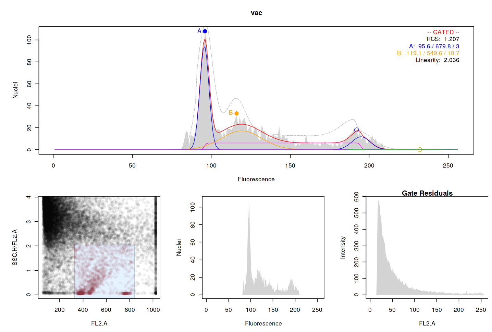

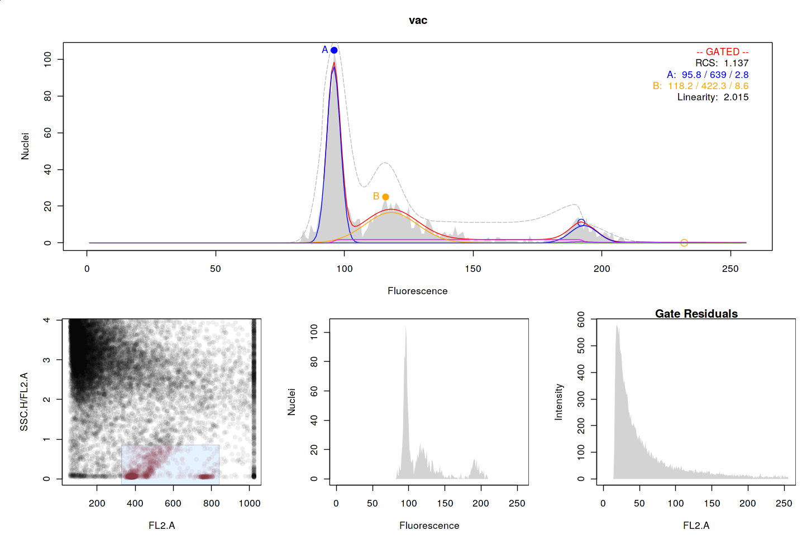

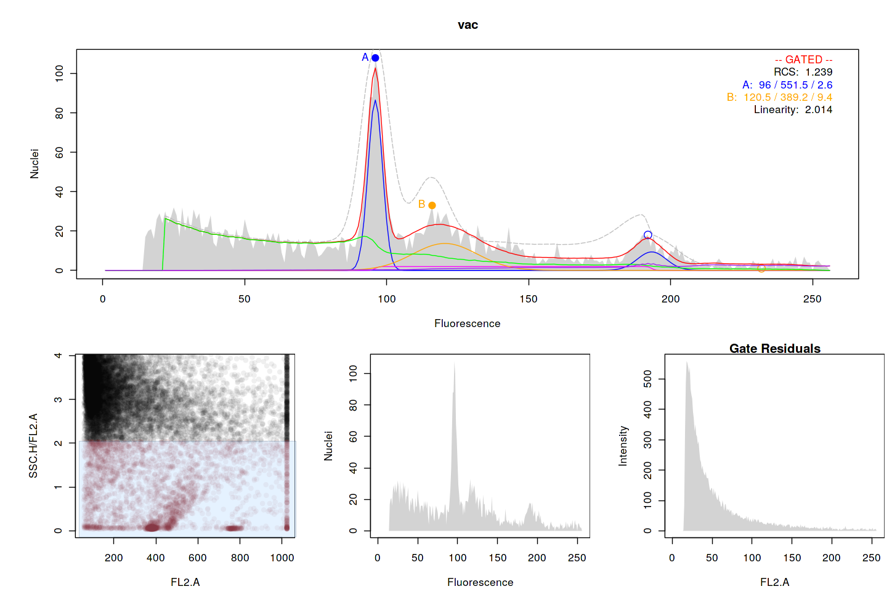

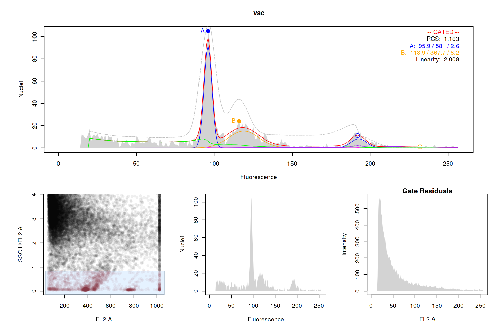

The peak ratio varies from 1.233 to 1.255, the sample cell count varies
from 367.7 to 549.6, and the sample CVs vary from 8.2 to 10.7. Making
comparable changes in the gate in CellQuest we can manipulate the CV from X
to Y and cell count values from W to Z.

**Is this actually better than CellQuest? How much variation can we
generate with CellQuest on the same sample?**

Vac.ON.DL.14.026

# Nitty Gritty

**This should probably be moved to a separate 'reference manual', as it has
no particular narrative flow.**

We have now run through the complete FCM workflow in `flowPloidy`. For more
details, see the help files provided with the package (i.e., `?FlowHist`,
`?browseFlowHist` etc.). The remainder of this vignette will discuss some
of the finer details of the model-fitting procedure.

## Residual Chi-Square
@bagwell_1993 recommended the Residual Chi-Square as a measure of
goodness-of-fit for FCM histogram models. The RCS is calculated as
$\frac{\chi{}^2}{n - m}$ where $\chi{}^2$ is the familiar Chi-Square
statistic ($\sum \frac{(\text{observed} -
\text{expected})^2}{\text{observed}}$), $n$ is the number of data points,
and $m$ is the number of model parameters. Values above 4.0 indicate a poor
fit, while values less than 0.7 indicate over-fitting.

This corrects a problem with the regular $\chi^2$, which is dependent on
the number of data points. In the process of generating a histogram, the
data channel is partitioned in to bins. A 256-bin histogram will produce a
lower $\chi^2$ value than a 1024-bin histogram for the same data.
Similarly, increasing the number of model parameters will lower the
$\chi^2$, which could encourage over-fitting. Correcting the $\chi^2$ by a
factor of $n-m$ addresses both of these issues.

That said, the RCS is not without drawbacks of its own. @rabinovitch_1994
note that the $\chi^2$ value is "affected by a large number of variables,
not all related to goodness of fit; [including] ... the end points of the
analysis region used within the histogram". This has been our experience
with `flowPloidy`. FCM histograms are typically quite noisy in the first
few (lowest) bins, and often have a long tail of low values at the upper
end. These regions of the histogram have little, if any, influence on the
parameter estimates of interest to us (i.e., peak means, CVs, and cell
counts). However, they can have a large influence on the RCS. Making small
changes in the start and end of the analysis region, or the way the upper
bins are modeled (particularly with the aggregate or S-phase model
components) can have a dramatic influence on the RCS value.

In practice, the RCS is most useful as an indicator of potential problems
with the model fit, as illustrated in the example above. However, it is
most appropriately used as a general guideline, not an absolute criterion
of quality.

## Linearity
Linearity measures the relationship between G1 and G2 peaks of the same
sample. Theoretically, it *should* be 2. However, it frequently differs,
presumably do to conditions particular to the operation of a particular
flow cytometer at a given time. By default, `flowPloidy` will fit linearity
as a model parameter, bounded between 1.9 and 2.1. However, in rare cases
switching to a fixed value of 2 may help address models that get stuck in a
local minimum. Toggling this option for a single file can be done in the
`browseFlowHist()` interface, or it can be set for a batch of files during
initial processing by passing the `linearity = "fixed"` argument to the 
`batchFlowHist()` and `FlowHist()` functions.

## Debris Models
## GUI options

## Working from the Console
