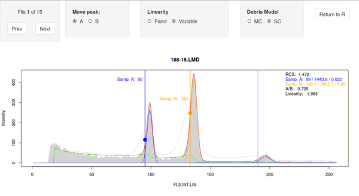
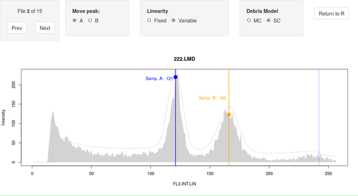
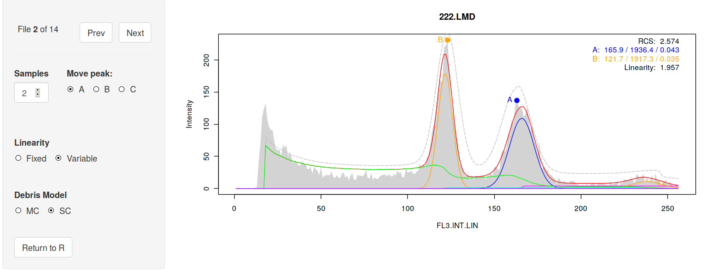
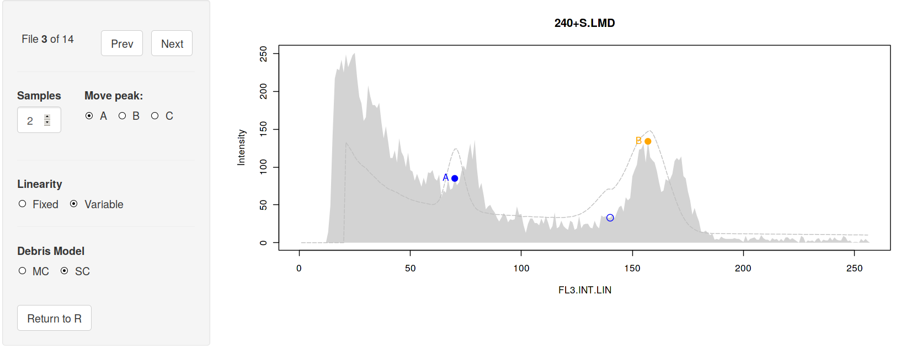
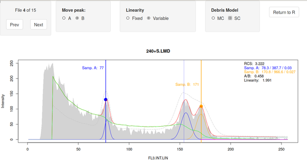
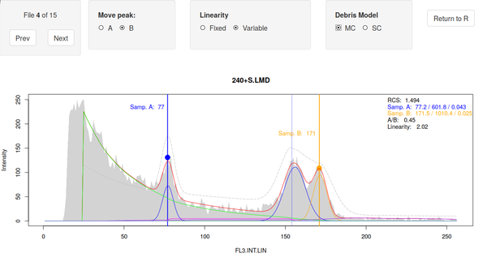
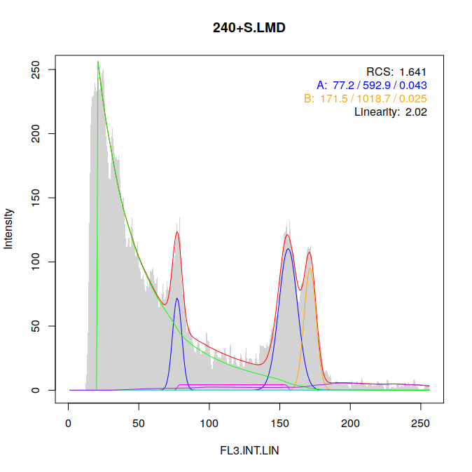

# Installation

`flowPloidy` is part of the [BioConductor](bioconductor.org) respository.
To install it, you must first have the Bioconductor system installed. To
do, from within R, call:

```{r, eval=FALSE}
source("https://bioconductor.org/biocLite.R")
biocLite()
```

Then install `flowPloidy`:

```{r, eval=FALSE}
biocLite("flowPloidy")
```

The examples in this vignette, and the `flowPloidy` help files, use data in
the `flowPloidyData` package, which is also on BioConductor. (You don't
need `flowPloidyData` to use `flowPloidy` on your own data, only for the
examples).

```{r, eval=FALSE}
biocLite("flowPloidyData")
```

## Development Version 

You may also install the developmental version of `flowPloidy` directly
from its [Github repository](https://github.com/plantarum/flowPloidy). To
do so, you will need the `devtools` package:

```{r, eval = FALSE}
install.packages("devtools", dependencies = TRUE)
library("devtools")
install_github("plantarum/flowPloidy")
```

Note that the developmental version of `flowPloidy` is also available
directly from BioConductor, *if* you are using the development branch.
Instructions on how to do so are available on the [BioConductor 
    website](http://bioconductor.org/developers/how-to/useDevel/).

# Preliminaries

## Sample Data Files

Once our packages are installed, we only need to load them into memory to
use them: 

```{r}
library(flowPloidy)
library(flowPloidyData)
```

The `flowPloidyData` package provides a single variable, `flowPloidyFiles`.
This is a vector of file names that points to the sample FCS files in your
R installation that we will use in this vignette. The actual path to the
files will differ slightly on different computers, and on different
operating systems; R takes care of those details for us.

## Data Channel

You will need to know which channel to use for your analysis. This will
most likely remain the same for all analyses from the same flow cytometer.
We can use the `viewFlowChannels` function to see the options:

```{r, output = "hold"}
viewFlowChannels(flowPloidyFiles[1])
```

(In this example, we're using the filename in the variable
`flowPloidyFiles[1]`; to examine your own data, replace that with the name
of a FCS data file of your own.)

Hopefully you see something there that corresponds to the channel you're
interested in. In our case, it's "`FL3.INT.LIN`". 

# Simple Analysis

With all the necessary packages installed, and the name of the channel of
interest identified, we are ready to proceed with a `flowPloidy` analysis.

```{r}
fh1 <- FlowHist(file = flowPloidyFiles[1], channel = "FL3.INT.LIN",
                analyze = FALSE)
```

(Note that we used the `analyze = FALSE` option, to delay analysis until we
have inspected the data, for the purposes of this tutorial. This is not
necessary, and if you omit the `analyze` argument analysis will proceed
automatically.)

Now that we have our data loaded, `plot` will display it for us:

```{r simplePlot, fig.cap = "FCS Histogram"}
plot(fh1)
```

During the loading process, `flowPloidy` attempts to locate cell
populations and identify initial values for model fitting. You can see this
by setting the `init = TRUE` argument in the `plot` function:

```{r initialValues, fig.cap = "Histogram with Initial Values"}
plot(fh1, init = TRUE)
```

A number of features are displayed on the histogram:

Sample A G1 estimate

: a solid blue circle labelled with the letter A is the initial 
estimate of the first sample ('A') G1 peak. 

Sample A G2 estimate

: a hollow blue circle ('O') indicates the estimated position of the G2
peak corresponding to the A G1 peak.

Sample B G1 and G2 estimates

: as for Peak A, but the circles and labels are orange

Initial model estimate

: the thin, dashed grey line indicates model fit using the initial
parameter estimates

The initial estimate is rough, but in this case it's close enough for the
model-fitting routines to find a solution, so we can immediately proceed to
the complete analysis.

```{r}
fh1 <- fhAnalyze(fh1)
```

Note that I have assigned the output of `fhAnalyze()` to the original
`flowHist` object `fh1`. The output of the analysis is stored in a new slot
in the `fh1` object -- all the original data remains unaltered in that
object.

Now that `fh1` contains a fitted model, the results will be displayed when
we call `plot` again:

```{r simpleAnalysis, fig.cap = "Histogram with Fitted Model"}
plot(fh1)
```

The plot has been updated to include the fitted model components in
different colours:

- green: debris model (by default the Single-Cut model, but see below)
- blue: sample A G1 and G2 peaks
- orange: sample B G1 and G2 peaks
- magenta: S-phase of sample A 
- turqoise: S-phase of sample B
- purple: aggregates
- red: the complete model

The aggregate and S-phase components may be quite small, and therefore
difficult to see. The red complete model plotted first, so it gets obscured
when it exactly matches another component. For example, until ca. 75 the
green debris model is the only component contributing to the total model,
so we see only the green line, not the underlying red line.

In the upper right corner, we see a brief summary of the numerical results.
For Sample A and Sample B, peak statistics are reported as `position / cell
counts / coefficient of variation`. We can see that the coarse initial
estimates were indeed close enough to give us a reasonable model fitting.
The numerical results are now available by printing the `FlowHist` object:

```{r, output = "hold"}
fh1
```

Here we see the ratio between the peaks with the standard error of the
ratio, and a table of peak data: nuclei counts (i.e., the number of nuclei
modelled in the G1 peaks), peak size, the coefficient of variation for the
peak, and the Reduced Chi-Square value (RCS) recommended by @bagwell_1993
as an objective assessment of model fit (but see @rabinovitch_1994 for a
contrasting view).

# Manually Selecting Starting Values

Sometimes, particularly with noisy histograms, `flowPloidy` will not
produce useful starting values:

```{r noisyData, fig.cap = "Histogram with Bad Initial Values"}
fh2 <- FlowHist(file = flowPloidyFiles["734.LMD"], channel = "FL3.INT.LIN")
plot(fh2, init = TRUE)
```

Here we can see that the noise around the first peak has resulted in a poor
selection of initial values. The model was fit, but the results are
nonsense. We can manually set the appropriate starting values with
`pickInit`:

```{r, eval = FALSE}
fh2 <- pickInit(fh2)
```

`flowHist` will prompt you to click on the peaks of the first and second
peak manually, adding a circle to the plot at each point.

```{r fakingInteraction, echo = FALSE, fig.cap = "Histogram with Manually Selected Peaks"}
## This stuff is automatically done by the interactive function pickInit,
## which we can't actually use in the automated vignette.
## Using internal functions here, not intended for use by users

fh2 <- flowPloidy:::resetFlowHist(fh2)
flowPloidy:::fhPeaks(fh2) <-
  structure(c(50.3852998991202, 139.786453999919, 255.890905972485, 
              178.859300819953), .Dim = c(2L, 2L),
            .Dimnames = list(NULL, c("mean", "height")))

fh2 <- flowPloidy:::addComponents(fh2)
fh2 <- flowPloidy:::makeModel(fh2)
fh2 <- flowPloidy:::getInit(fh2)

plot(fh2)
points(flowPloidy:::fhInit(fh2)$Ma, 255, col = 2, cex = 3)
points(flowPloidy:::fhInit(fh2)$Mb, 175, col = 3, cex = 3)
```

The new peak values are used to recalculate the initial values:

```{r initPick, fig.cap = "Histogram with Corrected Initial Values"}
plot(fh2, init = TRUE)
```

Now we are ready for the analysis:

```{r correctedAnalysis, fig.cap = "Histogram with Fitted Model"}
fh2 <- fhAnalyze(fh2)
plot(fh2)
fh2
```

# Model Options

## Debris Models
By default, the histogram analysis uses the Single-Cut Debris model,
[described in @bagwell_mayo_ea_1991]. This works well for most of our data.
However, @bagwell_1993 recommends the Multi-Cut model for fresh material,
and in some cases it provides better RCS values (although peak parameters
rarely change significantly).

There are a few ways to switch to the Multi-Cut model. You can update a
`FlowHist` object with the function `updateFlowHist`:

```{r multi-cut model}
fh2MC <- updateFlowHist(fh2, debris = "MC")
plot(fh2MC)
```

In this case, the Multi-Cut model produced a RCS value slightly higher than
that of the Single-Cut model. Note, however, that the peak parameters
hardly changed, and the A/B ratio is identical.

You may also choose which debris model to use as an argument to `FlowHist`
(and the related `batchFlowHist` discussed below):

```{r FlowHist multi-cut, eval = FALSE}
fh2MC <- FlowHist(file = flowPloidyFiles["734.LMD"],
                  channel = "FL3.INT.LIN", debris = "MC")
```

A third option for changing the debris model is to use the interactive
plotting function `browseFlowHist`, described below.

## Linearity
By default, linearity (the ratio between the G1 and G2 peaks of the same
sample) is fit as a parameter. Ideally, linearity should be 2, but due to
issues with the running of the flow cytometer, it frequently varies between
ca 1.9 and 2.1. If you want to force linearity to be fixed at 2, you can
use the `linearity` argument to `updateFlowHist` or `FlowHist`, as we did
for `debris` above. In this case, possible values for `linearity` are
`fixed` (fixed at 2), or `variable` (fit as a parameter). When `linearity`
is `fixed`, it is reported as `fixed` in plot and summary functions. You
may also set/change `linearity` with the `browseFlowHist` GUI described
below.

# Exporting Results

To summarize the results in a data table, use the `tabulateFlowHist`
command: 

```{r}
tabulateFlowHist(fh1)
```

To combine multiple objects in a single summary, combine them as a list:

```{r}
tabulateFlowHist(list(fh1, fh2))
```

As a convenience, if you pass a file name to the `file` argument of
`exportFlowHist`, the table will be saved to that file:

```{r, eval = FALSE}
tabulateFlowHist(list(fh1, fh2), file = "flow-results.csv")
```

# Processing Directories with `batchFlowHist`

## Generating a file list in R

If you have a large number of files to process, `flowHist` can read them
all in together. The `batchFlowHist` function provides this feature. To use
it, you need a list of file names to process. The R function `list.files()`
is helpful here. If your FCS files are in the directory "`datadir/`", you
can collect all their names using:

```{r, eval = FALSE}
my.files <- list.files("datadir/", full.names = TRUE)
```

If you have a mix of FCS files and other files together, you can supply a
pattern to match only your data:

```{r, eval = FALSE}
my.files <- list.files("datadir/", pattern = ".LMD", full.names = TRUE)
```

If you want to combine directories, use `c()`:

```{r, eval = FALSE}
my.files <- list.files("datadir1/", full.names = TRUE)
my.files <- c(my.files, list.files("datadir2/", full.names = TRUE))
```

For this example, I'll continue to use the sample data included with
`flowPloidyData`. Here, we'll use all of them (i.e., `flowPloidyFiles`),
not just one (e.g. `flowPloidyFiles[1]`).

## Using `batchFlowHist`

The `batchFlowHist()` function has two required arguments:

files

: a vector of file names (character), such as we generated in the previous
section.

channel

: a string (character) indicating the data channel to read, which we
discovered using the function `viewFlowChannels()` above.

The following optional arguments may also be used:

bins

: the number of bins to group the data into (default: 256)

verbose

: boolean, if `TRUE` (the default) report the filenames as they are
processed. Useful for debugging, or tracking progress on long-running jobs

window

: numeric, the size of the moving window used to identify local peaks
(default: 20)

smooth

: numeric, the size of the moving window used to reduce noise in the
histogram during peak detection (default: 20)

debris

: character, either "SC" or "MC" to use the Single-Cut or Multi-Cut debris
model, as described above. (default: "SC")

linearity

: character, either "fixed" or "variable" to set the linearity parameter to
2, or allow it to be fit as a model parameter, as described above.
(default: "variable")

If you have clean, narrow peaks, you may want to lower the values of
`window` and `smooth`, say to 16 and 8 respectively. Don't worry about
finding perfect values, we provide a GUI interface (below) to allow for
quick and painless correction of peak detection.

```{r histBatch}
batch1 <- batchFlowHist(flowPloidyFiles, channel = "FL3.INT.LIN")
```

(You will see some **Error** messages in the output. That's ok, we'll fix
the problems shortly!)

You can export the results with `tabulateFlowHist()`:

```{r}
tabulateFlowHist(batch1)
```

You can scroll through the resulting plots with the following code:

```{r, eval = FALSE}
parOld <- par(ask = TRUE)
lapply(batch1, FUN = plot)
## press enter to scroll through your files!
par(parOld)
```

However, that's a bit tedious if you need to tweak the parameters for any
of the individual `FlowHist` datasets in the list. A more covenient
approach is provided by the `browseFlowHist` function, which also allows us
to address the histograms for which our analysis failed. This is described
in the next section.

# `browseFlowHist`

`browseFlowHist` uses the [Shiny](shiny.rstudio.com) framework to provide
an interface for viewing histograms. The main purpose of this interface is
to allow users a simple, quick way to confirm that the fitted models are
sensible, and to correct the most common problem: misidentified peaks that
lead to bad starting parameters.

To use `browseFlowHist`, pass it the list of `FlowHist` objects we created
with `batchFlowHist` above:

```{r browseFlowHist, eval = FALSE}
batch1 <- browseFlowHist(batch1)
```

**IMPORTANT** remember to assign `browseFlowHist(batch1)` to a variable. If
you don't, all of the corrections you make will be discarded when you close
the app. If you want to keep the original values, assign it to a new
variable, i.e., `batch1_corrected <- browseFlowHist(batch1)`.

At this point, R should respond with:

```
Listening on http://127.0.0.1:3459
```

(the number after the `:` will probably be different!)
and your web browser will open to display something like this:



(You may need to maximize your browser window for the layout to look
'correct')

In the upper-left corner you will find the navigation. Click on `Prev` and
`Next` to move backwards and forwards over your list of files. Note the
counter - you can't move past the first or last files, of course.

For the first histogram, file `188-15.LMD`, the model fit is quite good, so
we don't need to worry about improving the initial parameters. Click on the
`Linearity` or `Debris Model` buttons to see how much difference these
options make (not much in this case). Notice that as you change the
options, the model fit updates automatically. **The last selections you
make before moving on to the next plot are the ones that will be saved!**

The second plot, for `222.LMD`, doesn't show a fitted model:



This is due to bad initial peak estimates -- the `A` peak was placed on a
local maximum in the noise around 60, and the `B` peak was placed where we
would expect the `A` peak to be. To fix this, we move the `B` peak
estimate. First, click on the `B` button in the sidebar on the left. Then
click on the top of the second peak (near 170). Now click on the `A` button
in the side bar, and then set the new estimate at the top of the first
peak.

As you click on the plot, the analysis updates using the new initial peak
estimate.

Once a good initial peak is selected, the analysis succeeds with a good
fit:



Move ahead to the `240+S.LMD` file. Again, the initial estimates didn't
work, so this plot needs to be corrected, as we did on the previous plot.



We need to move the `A` and/or `B` peaks until we get something sensible:



That's better. However, in this case, the Multi-Cut debris model fits even
better:



Browse through the rest of the histograms to see which ones succeeded, and
which ones need correction. You should be able to get acceptable fits (RCS
< 4) for all of them, despite the fact that some of these files are poor
quality data.

When you're done, click on `Return to R` to get back to the command line.
(You can close the browser window **after** you click this, **not
before**). Now all you're corrected analyses will be stored in the variable
you passed the results of `browseFlowHist()` to. You can check this with:

```{r flowShiny-output, eval = FALSE}
plot(batch1[["240+S.LMD"]])
```



We have the corrected model fits, so we can export the data for further
analysis:

```{r flowShiny-export, eval = FALSE}
tabulateFlowHist(batch1)
```

Remember, if you don't pass a `file` argument to `tabulateFlowHist` it only
prints the results to he screen, they aren't saved in a file (which file
could it be?). To save the results of your analysis to disk, use:

```{r, eval = FALSE}
tabulateFlowHist(batch1, file = "my-analysis-output.csv")
```

# References
